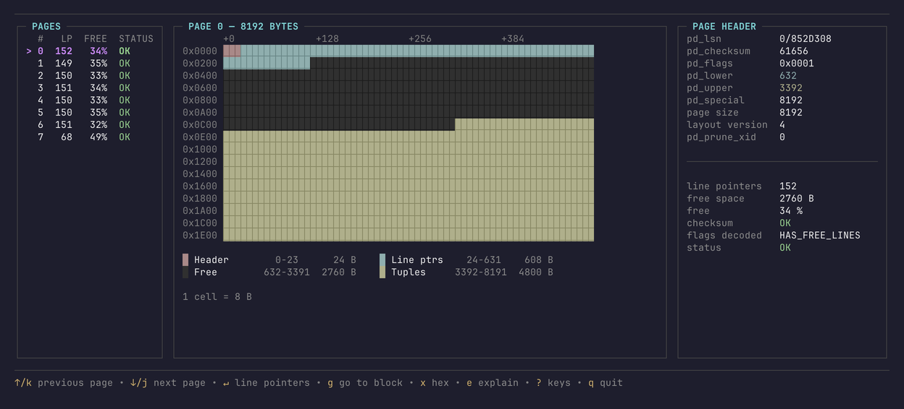

# pgpage

A read-only explorer for the pages of PostgreSQL heap relation files, as a
terminal UI, a command line tool and a Go library.

pgpage opens a relation segment file straight from `PGDATA`, decodes each
8 kB page and shows what is in it: the page header, the line pointer array,
the heap tuples and their headers, the free space, and the raw bytes. It
verifies page checksums and flags line pointers and tuple headers that break
the rules of the page layout. An explain mode walks through every field of
the page header with its bytes, its value on this page, and what PostgreSQL
uses it for.

It never writes to the file. It reads the file as it is on disk, so pages
that are only dirty in shared buffers are not seen until a checkpoint.

> **Early stage.** Commands and the Go API may change before 1.0, and what
> it shows may be wrong: check anything surprising against `pageinspect`.
> It is read-only, so trying it on real data is safe.



## Install

pgpage is a single binary with no runtime dependencies. It needs Go 1.26 or
later to build.

```bash
go install github.com/arturobermejo/pgpage/cmd/pgpage@latest
```

Or from a clone of the repository:

```bash
go build ./cmd/pgpage
```

## Usage

Find the file of a table from `psql`, then open it:

```sql
SELECT current_setting('data_directory') || '/' || pg_relation_filepath('my_table');
```

```bash
pgpage /var/lib/postgresql/data/base/16384/24576
```

Relation files are owned by the `postgres` user and readable only by it, so
run pgpage as that user or copy the file first. A relation larger than 1 GB
is split into segments (`24576`, `24576.1`, ...); pgpage opens one segment
at a time and numbers its blocks from 0.

### Interactive explorer

`pgpage <relation-file>` opens the explorer on block 0, or on `--block N`.
The main screen lists the pages of the relation with their line pointer
count, free space and status, draws the selected page as a map of its
regions (header, line pointers, free space, tuples, special space) and shows
its decoded header.

| Key | What it does |
| --- | --- |
| `↑`/`↓`, `PgUp`/`PgDn`, `Home`/`End` | move through pages, line pointers or tuples |
| `g` | go to a block or line pointer by number, in decimal or `0x` hex |
| `↵` | open the line pointers of a page, then the tuple of a line pointer |
| `x` | hex dump of the page, scrolled to the selection and with its bytes highlighted |
| `e` | explain mode: each field of the page header, byte by byte |
| `r` | read the page again from disk |
| `?` | every key binding |
| `Esc` | back |
| `q` | quit |

The line pointer view lists every entry of the array with its state
(`NORMAL`, `REDIRECT`, `DEAD`, `UNUSED`), offset and length, and marks the
ones that fail their checks. Selecting one highlights both its 4-byte entry
and the tuple it points to on the page map. The tuple view decodes the heap
tuple header: `t_xmin`, `t_xmax`, `t_cid`, `t_ctid`, both infomasks with
their flags spelled out, `t_hoff`, the null bitmap, and the attribute bytes
as a hex dump. Attribute values stay raw: the page does not store the
table's schema.

Pages that are all zeroes are shown as `NEW`, and pages whose header does not
parse as `INVALID`, with the parser's reason. Neither stops navigation.

### Command line

The same decoding is available as plain text, for scripts and pipes.

```bash
pgpage inspect <relation-file> [--block N]
```

```
Block:          2
LSN:            0/21A8AF0
Checksum:       7780 (OK)
Line pointers:  180
Free space:     1728
Layout version: 4
Status:         OK
```

```bash
pgpage lp <relation-file> [--block N]
```

```
LP   STATE     OFF   LEN  XMIN  XMAX  FIELD3  CTID     INFOMASK  INFOMASK2  HOFF  DETAIL
1    DEAD      0     0    -     -     -       -        -         -          -     -
2    NORMAL    8152  37   775   0     0       (2,2)    0x0902    0x0002     24    HASVARWIDTH,XMIN_COMMITTED,XMAX_INVALID
10   REDIRECT  168   0    -     -     -       -        -         -          -     →168
```

```bash
pgpage validate <relation-file>
```

`validate` scans every page of the file, prints one line per problem and a
summary, and exits with status 1 if it found any: an invalid header, a
checksum that does not match the page, a line pointer outside the tuple
space, a tuple header that cannot be decoded, or a partial last page.

```
scanned 3 pages: 3 OK, 0 NEW, 0 INVALID, 0 bad line pointers or tuples, 0 bad checksums
```

Exit codes are 0 on success, 1 when the command ran but failed or found
problems, and 2 for a wrong command line.

## As a library

The root package `github.com/arturobermejo/pgpage` does the decoding and has
no dependency on the terminal UI.

```go
rel, err := pgpage.OpenRelation("/var/lib/postgresql/data/base/16384/24576")
if err != nil {
    log.Fatal(err)
}
defer rel.Close()

for block := range rel.PageCount() {
    page, err := rel.ReadPage(block)
    if err != nil {
        log.Fatal(err)
    }

    s := pgpage.SummarizePage(page, block)
    if s.Status != pgpage.StatusOK {
        fmt.Printf("block %d: %v\n", block, s.Status)
        continue
    }

    for n := pgpage.FirstOffsetNumber; int(n) <= s.Header.ItemCount(); n++ {
        t, err := pgpage.HeapTupleAt(page, s.Header, n)
        if err != nil {
            continue // no tuple behind this line pointer
        }

        fmt.Printf("(%d,%d) xmin=%d xmax=%d\n", block, n, t.Header.Xmin, t.Header.Xmax)
    }
}
```

The main types are `PageHeader`, `ItemID`, `HeapTupleHeader` and `HeapTuple`,
with `ParsePageHeader`, `ParseItemIDs` and `ParseHeapTupleHeader` to decode
raw bytes, `PageChecksum` and `VerifyChecksum` for data checksums, and
`PageRegions` to split a page into its regions. See the package
documentation for the rest.

## What it understands

- Heap relations. Index pages open and their headers decode, but their
  items are not heap tuples and are not interpreted as such.
- The default 8192-byte page size and page layout version 4, which every
  release since PostgreSQL 8.3 writes.
- Files written on a little-endian, 64-bit platform, which is what
  PostgreSQL runs on almost everywhere. Alignment checks assume 8-byte
  `MAXALIGN`.
- Data checksums, computed exactly as `pg_checksum_page` does, including
  the block number.

Attribute values are not decoded: that takes the table's catalog entry,
which the relation file does not contain.

## Development

```bash
make tools   # installs the pinned golangci-lint
make         # fmt, lint and test
make test    # go test -race ./...
```

The tests run against `testdata/heap_small`, a real three-page relation
file generated by `scripts/make-fixture.sh` from a local PostgreSQL server,
together with the output of `pageinspect` for every page and line pointer.
The parsers are checked against that output, so they agree with PostgreSQL
and not only with themselves. Regenerating the fixture needs `psql` and a
server with the `pageinspect` extension:

```bash
make fixture
```

Continuous integration runs the linter and the tests on every push and pull
request.

## Contributing

Issues and pull requests are welcome. Bug reports about a page that pgpage
decodes differently from `pageinspect` are the most useful ones: please
include the PostgreSQL version and, if you can share it, the page.

Keep changes small and covered by a test. Run `make` before opening a pull
request so that the linter and the race detector have seen the code.

## License

pgpage is released under the [MIT License](LICENSE).
